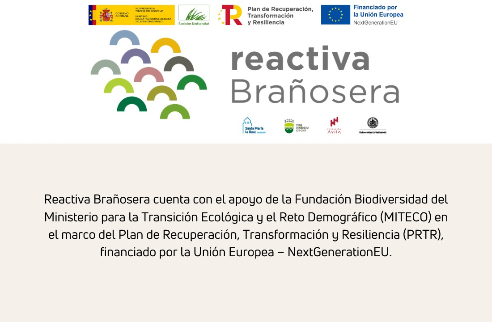

# Simulaciones selvícolas Reactiva Brañosera

Conjunto de documentos y resultados utilizados para simular distintos escenarios selvícolas en el marco del proyecto [Reactiva Brañosera](https://fundacion-biodiversidad.es/proyecto_prtr/investigacion-y-reactivacion-de-la-bioeconomia-forestal-en-los-terrenos-comunales-del-municipio-de-branosera-reactivabranosera/). 

---

## :open_file_folder: Contenido del repositorio

- [Escenario Selvicola/A15_ESCENARIO.pdf](Escenario%20Selvicola/A15_ESCENARIO.pdf): descripción del escenario A15 empleado en las simulaciones.
- [Modelo SIMANFOR/Masas_mixtas_Espana.pdf](Modelo%20SIMANFOR/Masas_mixtas_Espana.pdf): documentación de soporte del modelo SIMANFOR utilizado para las masas mixtas evaluadas.
- [Inventario Inicial/Inventario_Inicial.xlsx](Inventario%20Inicial/Inventario_Inicial.xlsx): inventario de partida sobre el que se ejecutaron las simulaciones.
- [Resultados/RESULTADOS_CONTROL.xlsx](Resultados/RESULTADOS_CONTROL.xlsx): salida del escenario sin intervención (control).
- [Resultados/RESULTADOS_PRESERVE_TREES.xlsx](Resultados/RESULTADOS_PRESERVE_TREES.xlsx): resultados para un manejo orientado a conservar pies seleccionados.
- [Resultados/RESULTADOS_MIXTO.xlsx](Resultados/RESULTADOS_MIXTO.xlsx): combinación de tratamientos contemplados en el estudio.
- [Resultados/RESULTADOSCLARA_POR_LO_BAJO.xlsx](Resultados/RESULTADOSCLARA_POR_LO_BAJO.xlsx): resultados de clara por lo bajo.
- [Informe/INFORME_ZENODO_ITINERARIO_RESULTADOS.pdf](Informe/INFORME_ZENODO_ITINERARIO_RESULTADOS.pdf): informe de síntesis con el itinerario selvícola y los resultados agregados.

---

## :thinking: Uso de los archivos

- Abra los PDF para consultar el planteamiento de escenarios, supuestos de modelización y el informe final.
- Revise las hojas de cálculo de `Resultados/` para comparar indicadores entre escenarios de gestión.
- El inventario inicial puede reutilizarse como entrada en SIMANFOR u otras herramientas de simulación.

## Licencia

Este trabajo se distribuye bajo licencia MIT (ver `LICENSE`). Cite el proyecto Reactiva Brañosera al reutilizar los materiales.
